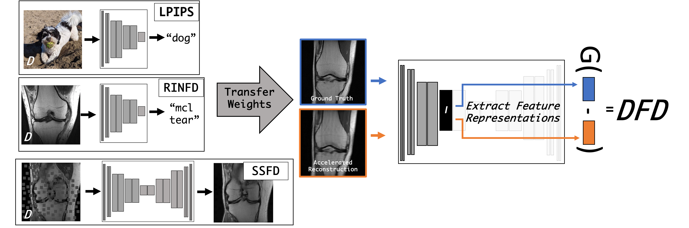

# Using Deep Feature Distances for Evaluating MR Image Reconstruction Quality

- <b> Title: </b>[Using Deep Feature Distances for Evaluating MR Image Reconstruction Quality](https://openreview.net/forum?id=AUiZyqYiGb)<br>
- <b>Authors: </b>[Philip M. Adamson](https://www.linkedin.com/in/philipadamson/), Arjun D Desai, Jeffrey Dominic, Christian Bluethgen, Jeff P. Wood, Ali B Syed, Robert D. Boutin, Kathryn J. Stevens, Shreyas Vasanawala, John M. Pauly, Akshay S Chaudhari, Beliz Gunel
- <b>Project Website: </b> https://stanfordmimi.github.io/deep-feature-mr-recon/
- <b>Contact: </b>{padamson} [at] stanford [dot] edu<br>



## Datasets
All reader study MR reconstructions and radiologist reader study scores can be downloaded [here](https://drive.google.com/drive/folders/1REr4R_geovFPpz1aYYX-P2GDBNTxosgc?usp=share_link). 

## Code

### Set-up
Create a conda environment for this project

```bash
conda conda create -n dfd_env python=3.9
conda activate dfd_env
```

Install torch
```bash
conda install pytorch torchvision cudatoolkit=10.1 -c pytorch
```

Finally install dependencies from the requirements.txt file

```bash
pip install -r requirements.txt
```

### Basic Usage
To compute metrics on the MR reconstruction reader study dataset, run the following command:

```bash
cd deep-feature-mr-recon # Path to your cloned repo
python deep-feature-mr-recon/reader_study_metrics.py --img_dir [path_to_image_folder] --results_dir [path_to_save_results]
```

The Jupyter Notebook ReaderStudy_vs_Metrics.ipynb can then be used to analyze correlations between the computed metrics and radiologist reader study scores.

### Advanced Usage
deep-feature-mr-recon is built on top of [meddlr](https://github.com/ad12/meddlr), a config-driven an ML framework built to simplify medical image reconstruction and analysis problems.
Deep Feature Metrics such as LPIPS and SSFD have been incorporated into meddlr to use as both an evaluation and optimization metric for any MR reconstruction task. 
See the meddlr documentation for more details.

## Citation

```
@inproceedings{adamson2023using,
  title={Using Deep Feature Distances for Evaluating MR Image Reconstruction Quality},
  author={Adamson, Philip M and Desai, Arjun D and Dominic, Jeffrey and Bluethgen, Christian and Wood, Jeff P and Syed, Ali B and Boutin, Robert D and Stevens, Kathryn J and Vasanawala, Shreyas and Pauly, John M and others},
  booktitle={NeurIPS 2023 Workshop on Deep Learning and Inverse Problems},
  year={2023}
}
```

