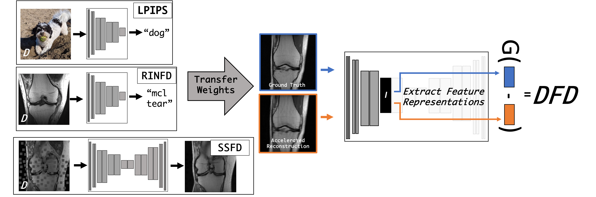

# Using Deep Feature Distances for Evaluating the Perceptual Quality of MR Image Reconstructions

- **Title:** [Using Deep Feature Distances for Evaluating the Perceptual Quality of MR Image Reconstructions](https://onlinelibrary.wiley.com/doi/10.1002/mrm.30437)
- **Authors:** [Philip M. Adamson](https://www.linkedin.com/in/philipadamson/), Arjun D Desai, Jeffrey Dominic, Maya Varma, Christian Bluethgen, Jeff P. Wood, Ali B Syed, Robert D. Boutin, Kathryn J. Stevens, Shreyas Vasanawala, John M. Pauly, Beliz Gunel, Akshay S Chaudhari
- **Project Website:** https://stanfordmimi.github.io/deep-feature-mr-recon/
- **Contact:** {padamson} [at] stanford [dot] edu



## Datasets
All reader study MR reconstructions and radiologist reader study scores can be downloaded [here](https://drive.google.com/drive/folders/1REr4R_geovFPpz1aYYX-P2GDBNTxosgc?usp=share_link). Note that in order to run the acquisition noise experiment, you will need to download the fastMRI raw k-space data from https://fastmri.med.nyu.edu/.

## Code

### Set-up
Create a conda environment for this project:

```bash
conda create -n dfd_env python=3.9
conda activate dfd_env
```

Install torch following instructions for your system from https://pytorch.org/get-started/locally/

Finally install dependencies from the requirements.txt file

```bash
pip install -r requirements.txt
```

### Basic Usage
To compute metrics on the MR reconstruction reader study dataset, run the following command:

```bash
cd deep-feature-mr-recon # Navigate to your cloned repo
python deep-feature-mr-recon/reader_study_metrics.py --img_dir [path_to_image_folder] --results_dir [path_to_save_results]
```

To run the acquisition noise experiment, run the following command:

```bash
cd deep-feature-mr-recon # Navigate to your cloned repo
python deep-feature-mr-recon/acq_noise.py --img_dir [path_to_image_folder] --kspace_dir [path_to_kspace_folder] --results_dir [path_to_save_results]

```

The Jupyter Notebook ReaderStudy_vs_Metrics.ipynb can then be used to analyze correlations between the computed metrics and radiologist reader study scores.

### Advanced Usage
The deep-feature-mr-recon project is built on top of [meddlr](https://github.com/ad12/meddlr), a config-driven an ML framework built to simplify medical image reconstruction and analysis problems.
Deep Feature Metrics such as LPIPS and SSFD have been incorporated into meddlr to use as both an evaluation and optimization metric for any MR reconstruction task. 
Refer to the meddlr documentation for more details.

## Citation

```
@article{AdamsonDFD2025,
  title        = {Using deep feature distances for evaluating the perceptual quality of MR image reconstructions},
  author       = {Adamson, Philip M. and Desai, Arjun D. and Dominic, Jeffrey and Varma, Maya and Bluethgen, Christian and Wood, Jeff P. and Syed, Ali B. and Boutin, Robert D. and Stevens, Kathryn J. and Vasanawala, Shreyas and Pauly, John M. and Gunel, Beliz and Chaudhari, Akshay S.},
  journal      = {Magnetic Resonance in Medicine},
  year         = {2025},
  doi          = {10.1002/mrm.30437}
}
```

